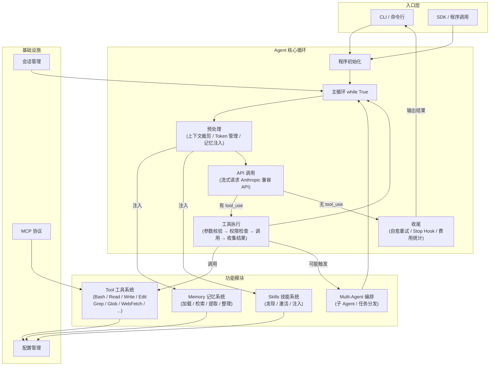

# 系统架构

> general-agent 整体架构、模块关系与数据流向。

---

## 模块关系图



## 数据流向

```
用户输入
  │
  ▼
程序初始化 ──→ 加载配置、MCP 连接、Skills 注册、Memory 索引
  │
  ▼
┌─ 主循环 while True ─────────────────────────────────┐
│                                                        │
│  预处理 ──→ 组装 system prompt                          │
│            (工具列表 + Memory 内容 + Skills 指令)        │
│     │                                                  │
│     ▼                                                  │
│  API 调用 ──→ 流式请求 Anthropic 兼容 API               │
│     │                                                  │
│     ├── text_delta ──→ 累积 AI 回复文本                 │
│     │                                                  │
│     └── tool_use ──→ 收集工具调用块                      │
│            │                                           │
│            ▼                                           │
│  工具执行 ──→ 参数校验 → 权限检查 → call() → 结果格式化   │
│            │                                           │
│            ▼                                           │
│  注入 tool_result 到对话历史 ──→ continue 回到预处理      │
│                                                        │
│  无 tool_use 时:                                        │
│    收尾 ──→ 自愈重试 / Stop Hook / 返回结果给用户        │
│              │                                         │
│              └── 旁路触发:                               │
│                   ├── Memory 提取 (stop hook)           │
│                   └── AutoDream 检查 (stop hook)        │
└────────────────────────────────────────────────────────┘
```

## 模块职责

| 模块 | 职责 | 触发时机 | v1 实现策略 |
|---|---|---|---|
| **Agent 核心循环** | 管理对话状态、调度 API 调用和工具执行 | 每次用户输入 | 完整实现核心流程，跳过高级自愈和压缩 |
| **Tool 工具系统** | 注册、校验、执行工具，返回结果 | AI 通过 tool_use 触发 | 实现 6-8 个核心工具，顺序执行 |
| **Memory 记忆系统** | 长期记忆存储与检索 | 启动加载 + 对话结束提取 | 全量加载 MEMORY.md，手动 `/memory save` |
| **Skills 技能系统** | 技能发现、匹配、注入 | 启动发现 + 工具触发 | 项目级静态 Skills + Inline 模式 |
| **Multi-Agent** | 子 Agent 创建、任务分发 | 由工具或用户触发 | v1 暂不实现 |
| **MCP 协议** | 外部工具集成 | 启动连接 + 动态发现 | 基础 stdio 传输 + 工具发现 |
| **API 集成** | LLM API 通信 | 每次 API 调用 | 完整 Anthropic API + OpenAI 代理 |
| **上下文压缩** | 长对话压缩为摘要 | Token 超过阈值 | 基础 auto-compact + microcompact |
| **沙箱安全** | 命令执行隔离 | 每次 Bash 调用 | macOS Seatbelt / Linux bwrap |

## v1 实现边界

```
✅ v1 实现:
  Agent 核心循环 (基础版)
  Tool 工具系统 (6-8 个核心工具)
  Memory 记忆系统 (文件级全量加载)
  Skills 技能系统 (静态 + Inline)
  MCP 协议 (stdio 传输 + 基础工具)
  API 集成 (Anthropic SDK + OpenAI 代理)
  上下文压缩 (auto-compact + microcompact)
  沙箱安全 (Seatbelt / bwrap)
  配置管理 (settings.json)

❌ v1 暂不实现:
  多 Agent 编排 ──────→ 单 Agent 足够
  流式工具执行 ────────→ 顺序执行即可
  Session Memory ─────→ 用 Memory 系统覆盖
  AutoDream ──────────→ 无多会话场景不需要
  OAuth / Channel ────→ 个人使用不需要
  Reactive Compact ───→ auto-compact 足够
```

---

> 最后更新: 2026-05-28 | 参考源 commit: 5a86ab0
